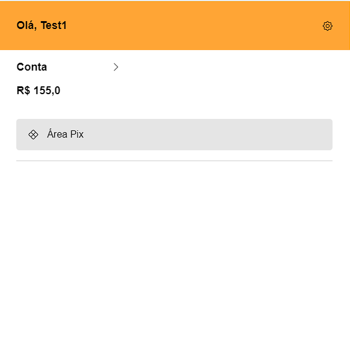
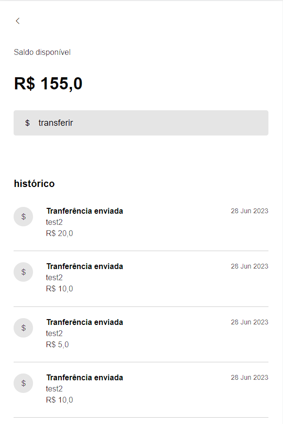
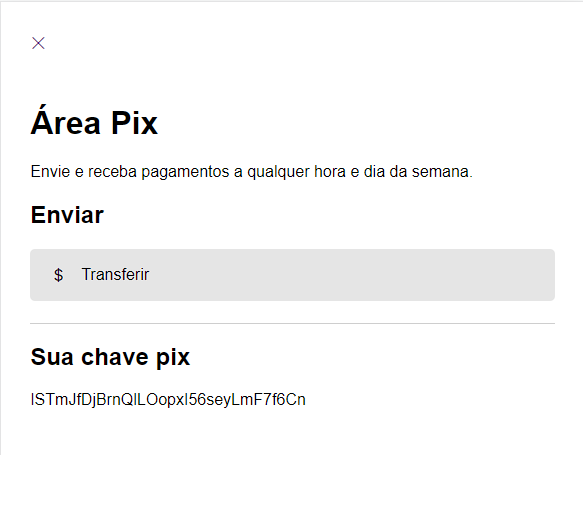
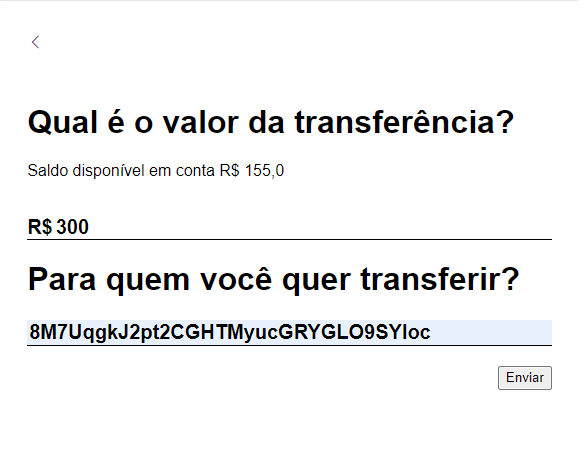
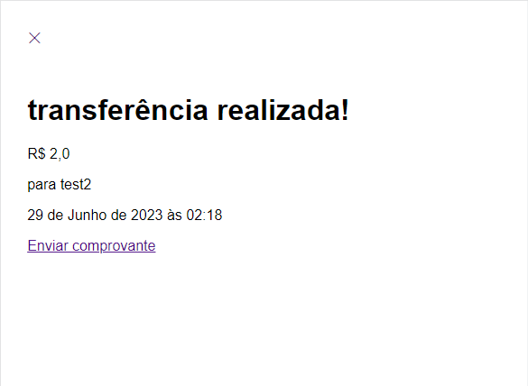

<h1 align="center">Bank Web App</h1>
<h2>Web application made with Django.</h2>
<h2>Features</h2>

Authenticate;

The user can see his bank account;

Do bank transactions to other users (pix),

<h2>App design</h2>

<h2>App images</h2>

<h2>How to install</h2>

Make a new folder and set a new venv

install in your command line:

Django

mysqlclient

Do a git clone

You have to connect a database to the application and run the migrations on terminal, for more information access the django documentation.

after that just run the server

