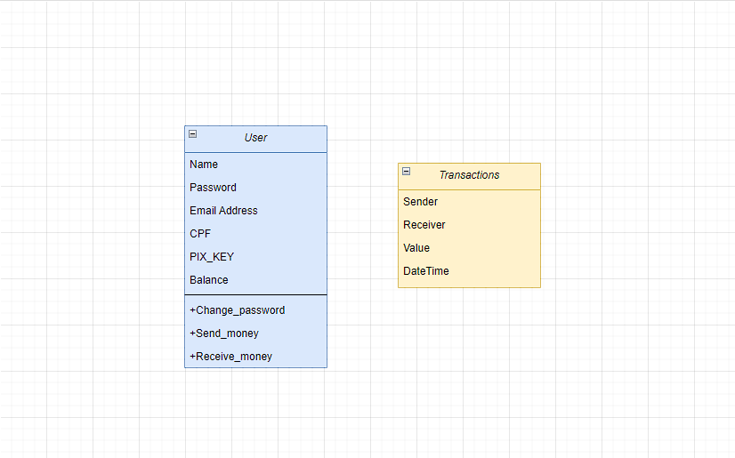

<h1 align="center">Bank App</h1>
<h2>Web application made with Django.</h2>
<h1>Features</h1>
<ul>
  <li>
User authentication
</li>
  <li>
Bank account management
</li>
  <li>
Transactions between users (pix)
</li>
</ul>
<h1>App design</h1>

<h1>App images</h1>

  <h2>Home Page</h2>
  

  <h2>account page</h2>
  

  <h2>pix page</h2>
  

  <h2>transaction page</h2>
  

  <h2>successfull message page</h2>
  

<h1>How to install</h1>

Make a new folder and set a new venv

install in your command line:

<ul>
  <li>
django
</li>
  <li>
mysqlclient
</li>
</ul>

do a git clone

you have to connect a database to the application and run migrations, for more information access the django documentation.

after that just run the server.

